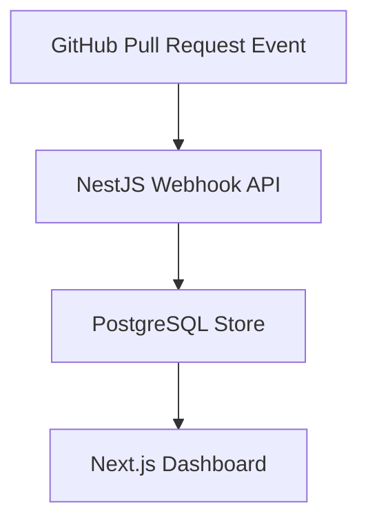

# CodeForge

AI-powered Pull Request Intelligence Platform.

## Goal

Automatically analyze GitHub Pull Requests using AI and provide:

- security findings
- code quality suggestions
- realtime analysis progress
- intelligent PR comments

## Tech Stack

### Frontend

- Next.js
- TypeScript
- Tailwind

### Backend

- NestJS
- TypeORM

### Database

- PostgreSQL

### Queue / Cache

- Redis
- BullMQ (coming in Week 2)

### AI

- OpenAI / Anthropic (coming later)

### DevOps

- Docker
- GitHub Actions

---

# Week 1 Milestone

Goal:
Receive GitHub Pull Request events and display them on dashboard.

Flow:

---

# Local Setup

## Start Infrastructure

docker compose up -d

## Run Backend

cd backend
npm run start:dev

## Run Frontend

cd frontend
npm run dev

---

# Services

Frontend:
http://localhost:3001

Backend:
http://localhost:3000

Health Check:
http://localhost:3000/health
